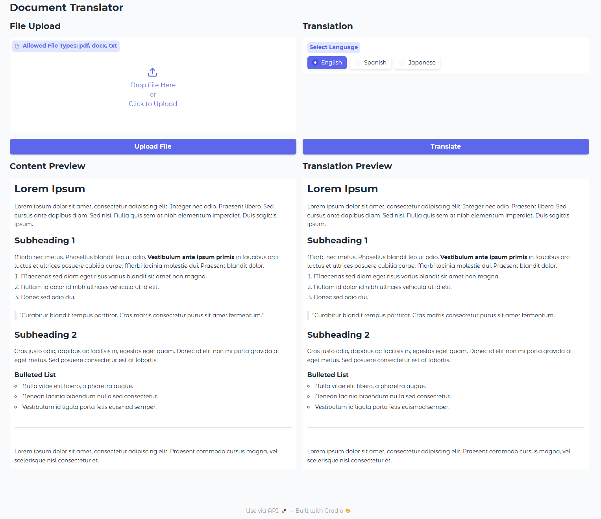

# Talk With Your Docs

Talk With Your Docs is a sample application that aims to demonstrate how to work with complex documents and how to talk with using an LLM.

The application is build in Gradio.

# Available Functions
## Document Translation
- Process a `.pdf` or `docx` with Azure Document Intelligence and extract the text as Markdown
- Transalate the document to `English`, `Spanish` or `English` using GPT-4o



# How to run the application
1. Clon the git repository

2. Install the dependencies (`requirements.txt` generated with `pip freeze`)
```
pip install -r requirements.txt
```

3. Create `.env` file inside the folder `01_doc_translator` with the following variables
```
# Document Intelligence Settings
DOC_AI_ENDPOINT   = 
DOC_AI_API_KEY    = 

# Azure OpenAI Settings
AOAI_ENDPOINT     = 
AOAI_API_KEY      = 
AOAI_API_VERSION  = 2024-06-01
AOAI_DEPLOYMENT   = 
```

4. Run the application
```
python ./01_doc_translator/doc_manager.py
```

# ToDo
- [ ] Fix the folder structure
- [ ] Add a chat functionality to be a able to talk with the document
- [ ] Create Startup script
- [ ] Clean up requirements.txt